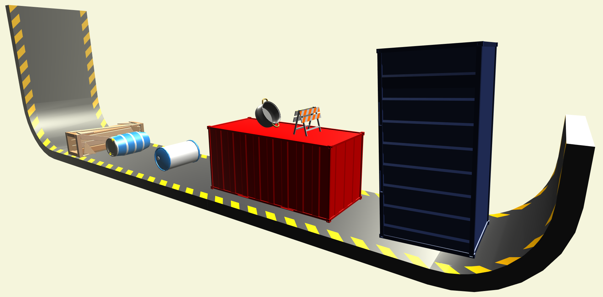

# Prazsky.Simulation
Game library for performing two-dimensional physical simulations in games with three-dimensional graphics.

## Dependencies
This library is dependent on the following resources:
* [MonoGame](https://github.com/MonoGame/MonoGame)
* [Aether.Physics2D](https://github.com/tainicom/Aether.Physics2D)

## Licence
The library is under the [Microsoft Public License (MS-PL)](https://opensource.org/licenses/MS-PL).

## Notes
* All comments in source code are currently written in Czech.